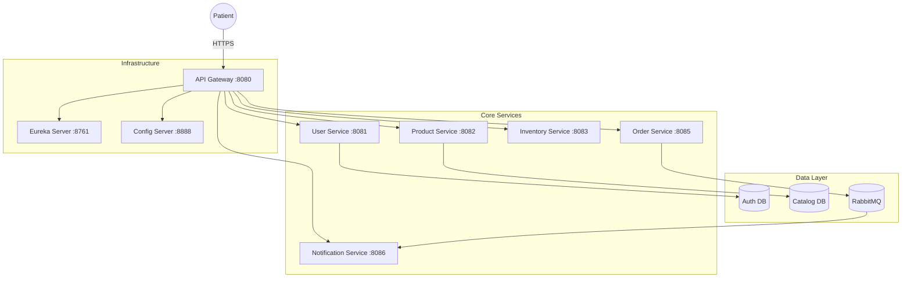

<div align="center">
  
  <h1>PharmaOrder</h1>
  <p><strong>A Modern, Microservices-Powered Pharmacy Ecosystem</strong></p>

  [](https://spring.io/projects/spring-boot)
  [](https://react.dev/)
  [](https://www.docker.com/)
  [](./LICENSE)
</div>

---

## 🌿 The Vision
PharmaOrder is a premium, enterprise-grade e-commerce platform designed to bridge the gap between patients and pharmacies. Built with a robust **12-service microservices architecture**, it offers seamless order management, real-time inventory tracking, and an intelligent health-pack engine.

## ✨ Key Features

### 🧠 Intelligent Health Pack Engine
Automatic detection of medicine bundles. When a patient adds individual recovery components (e.g., ORS, Dolo, Zincovit), the system instantly recognizes the **Health Pack** and applies transparent, bundled pricing.

### 🍱 Radical Transparency
Every health pack and medicine bundle includes a detailed "Includes" breakdown. Patients know exactly what they are buying, from the individual tablet counts to the verified prescription status.

### 📧 Real-World Notification System
Integrated with live SMTP (Gmail) to deliver professional order confirmations, prescription verification alerts, and loyalty updates directly to the user's inbox in their local currency (**₹**).

### 🏆 Loyalty & Loyalty Program
A integrated points system that rewards consistent wellness. Patients earn points on every order, redeemable for future healthcare needs.

## 🏗️ Architecture Map



## 🚀 Quick Start (Docker Preferred)

1.  **Clone the Repo**
    ```bash
    git clone https://github.com/Harsha430/pharma-order-microservices.git
    cd pharma-order-microservices
    ```

2.  **Launch Backend**
    ```bash
    cd backend
    mvn clean install -DskipTests
    docker-compose up -d
    ```

3.  **Launch Frontend**
    ```bash
    cd frontend
    npm install
    npm run dev
    ```

## 🛠️ Tech Stack
- **Backend**: Java 17, Spring Boot, Spring Cloud (Eureka, Config, Gateway), Feign, Hibernate.
- **Frontend**: React 18, TypeScript, TailwindCSS (Earthy Aesthetic), TanStack Query.
- **Infrastructure**: MySQL, Redis, RabbitMQ, Docker, Zipkin.

---
Built with ❤️ for the Modern Healthcare Experience.
