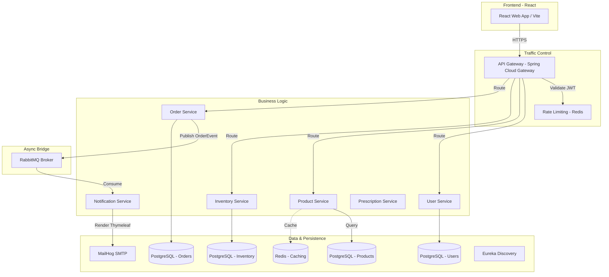

# 🏥 PharmaOrder - Enterprise Pharmacy E-Commerce Platform

[](https://spring.io/projects/spring-boot)
[](https://www.oracle.com/java/)
[](https://reactjs.org/)
[](https://microservices.io/)
[](LICENSE)

PharmaOrder is a cloud-native, microservices-based pharmacy e-commerce platform built with Spring Boot and React. It enables customers to browse medicines, upload prescriptions, place orders, and track delivery while providing pharmacy administrators complete control over inventory, prescription validation, and catalogue management.

---

## 📋 Table of Contents

- [Overview](#overview)
- [System Architecture](#system-architecture)
- [Microservices Ecosystem](#microservices-ecosystem)
- [Technology Stack](#technology-stack)
- [Key Features](#key-features)
- [Getting Started](#getting-started)
- [API Documentation](#api-documentation)
- [Security Model](#security-model)
- [Deployment & DevOps](#deployment--devops)

---

## 🎯 Overview

PharmaOrder is designed to solve the complexities of modern pharmaceutical retail by decoupling core business domains into scalable microservices. From handling sensitive prescription data to managing high-throughput inventory reservations, the platform ensures safety, compliance, and speed.

### Core Capabilities
- 🔍 **Smart Medicine Search** - Browse with category, dosage, and packaging filters.
- 📄 **Prescription Lifecycle** - Secure upload and pharmacist validation workflow.
- 🛒 **Real-time Inventory** - Optimistic locking and stock reservations during checkout.
- 📧 **Event-Driven Notifications** - Asynchronous branded HTML emails via RabbitMQ.
- 🎁 **Loyalty Engine** - Points-based rewards and dynamic discount management.

---

## 🏗️ System Architecture

PharmaOrder follows a **Choreography-based Saga Pattern** for distributed transactions and uses an API Gateway for unified security and routing.



---

## 🔧 Microservices Ecosystem

| Service | Port | Database | Primary Responsibility |
|---------|------|----------|------------------------|
| **API Gateway** | 8080 | Redis | JWT Validation, Rate Limiting, CORS, Routing |
| **Eureka Server** | 8761 | - | Service Discovery & Health Monitoring |
| **Config Server** | 8888 | - | Centralized service configuration (Git/Local) |
| **User Service** | 8081 | PostgreSQL | Authentication (BCrypt), RBAC, Profiles |
| **Product Service** | 8082 | PostgreSQL | Medicine Catalogue, Categories, Redis Caching |
| **Inventory Service** | 8083 | PostgreSQL | Stock Mgmt, Optimistic Locking, Batch Tracking |
| **Order Service** | 8085 | PostgreSQL | Cart Management, Checkout Flow, Order History |
| **Notification Svc** | 8086 | - | Thymeleaf HTML Templates, RabbitMQ Listener |

---

## 🛠️ Technology Stack

### Backend Fundamentals
- **Framework**: Spring Boot 3.4.0, Spring Cloud 2023.x
- **Language**: Java 17
- **Security**: Spring Security, JWT (JJWT 0.12), BCrypt
- **Messaging**: RabbitMQ (AMQP)
- **Persistence**: Spring Data JPA, Hibernate

### Frontend Fundamentals
- **Framework**: React 19.x, TypeScript 5.x
- **State Management**: Zustand, TanStack Query v5
- **Routing**: TanStack Router (File-based)
- **Styling**: Tailwind CSS 4.x, Lucide React

---

## 🚀 Getting Started

### 1. Prerequisites
- **Java 17+**
- **Node.js 20+**
- **Docker Desktop**
- **Maven 3.9+**

### 2. Infrastructure Deployment
Launch the backbone services using Docker Compose:
```bash
cd backend
docker-compose up -d postgres redis rabbitmq mailhog
```

### 3. Build & Run Services
```bash
# Parent build
mvn clean install -DskipTests

# Start in order:
# 1. Config Server (8888)
# 2. Eureka Server (8761)
# 3. API Gateway (8080)
# 4. Microservices (User, Product, Order, etc.)
```

### 4. Frontend Launch
```bash
cd frontend
npm install
npm run dev
```

---

## 📚 API Documentation

### Authentication Endpoints
- `POST /api/v1/auth/register` - Create new account.
- `POST /api/v1/auth/login` - Returns JWT and Refresh Token.
- `GET /api/v1/users/me` - Fetch authenticated profile.

### Product & Catalog
- `GET /api/v1/products` - List all medicines (Paginated).
- `GET /api/v1/products/categories` - Fetch medicine categories.
- `GET /api/v1/products/search?q=paracetamol` - Real-time search.

### Order Processing
- `POST /api/v1/orders/checkout` - Initialize order and stock reservation.
- `GET /api/v1/orders/user/{id}` - Fetch history for specific user.
- `PUT /api/v1/orders/{id}/status` - Update lifecycle (ADMIN).

---

## 🔐 Security Model

### JWT Token Strategy
- **Access Tokens**: Short-lived (15m), contains roles (ADMIN, CUSTOMER).
- **Refresh Tokens**: Long-lived, stored in DB for session management.
- **Validation**: Performed at the **API Gateway** level using a pre-shared secret, reducing latency for downstream services.

### Rate Limiting
Implemented via **Redis** and **Bucket4j**:
- **Guest IP**: 60 requests / minute.
- **Authenticated User**: 500 requests / minute.

---

## 🚢 Deployment & DevOps

### Containerization
All services are Docker-ready with multi-stage builds for minimal image size.
```bash
docker build -t pharmaorder/order-service:latest .
```

### Monitoring
- **Zipkin**: Distributed tracing for cross-service latency analysis.
- **Actuator**: `/health` and `/metrics` endpoints for Kubernetes probes.
- **ELK Stack**: Centralized log aggregation for production debugging.

---

## 🤝 Contributing & License
Distributed under the MIT License. See `LICENSE` for more information.

**Built with ❤️ for Modern Healthcare.**
