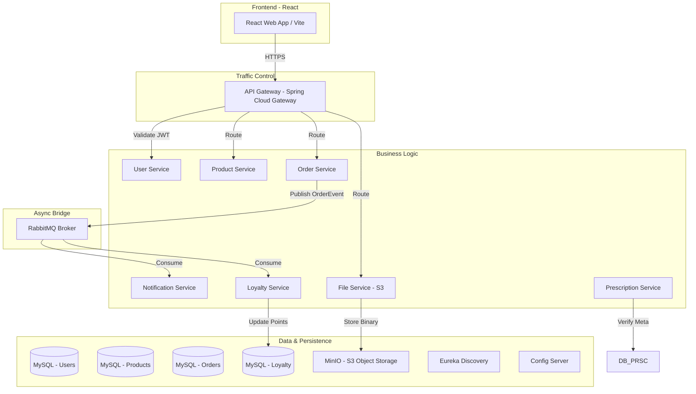

# 🏥 PharmaOrder - Enterprise Pharmacy E-Commerce Platform

[](https://spring.io/projects/spring-boot)
[](https://www.oracle.com/java/)
[](https://reactjs.org/)
[](https://microservices.io/)
[](LICENSE)

PharmaOrder is a cloud-native, microservices-based pharmacy e-commerce platform built with Spring Boot and React. It enables customers to browse medicines, upload prescriptions, place orders, earn health points, and track delivery while providing a seamless, secure, and highly scalable healthcare experience.

---

## 📋 Table of Contents

- [Overview](#overview)
- [System Architecture](#system-architecture)
- [Microservices Ecosystem](#microservices-ecosystem)
- [Technology Stack](#technology-stack)
- [Key Features](#key-features)
- [Getting Started](#getting-started)
- [API Documentation](#api-documentation)
- [Security Model](#security-model)

---

## 🎯 Overview

PharmaOrder is designed to solve the complexities of modern pharmaceutical retail by decoupling core business domains into scalable microservices. From handling sensitive prescription data via S3-compatible storage to managing a complex loyalty points system, the platform ensures safety, compliance, and speed.

---

## 🏗️ System Architecture

PharmaOrder follows a **Choreography-based Saga Pattern** for distributed transactions and uses an API Gateway for unified security and routing. File storage is handled by a dedicated service backed by **MinIO**.



---

## 🔧 Microservices Ecosystem

| Service | Port | Primary Responsibility |
|---------|------|------------------------|
| **API Gateway** | 8080 | JWT Validation, Routing, CORS Management |
| **Eureka Server** | 8761 | Service Discovery & Health Monitoring |
| **Config Server** | 8888 | Centralized configuration via native profile |
| **User Service** | 8081 | Authentication, RBAC, Profiles |
| **Product Service** | 8082 | Catalogue Mgmt, Enriched Data (Dosage, Packaging) |
| **Prescription Svc**| 8084 | Metadata for Prescription validation & lifecycle |
| **Order Service** | 8085 | Checkout Flow, Reorder logic, Saga orchestrator |
| **Notification Svc**| 8086 | RabbitMQ listener for Email delivery |
| **File Service** | 8087 | S3-compatible bridge for MinIO uploads |
| **Loyalty Service** | 8088 | Points accrual (1pt/₹100) and redemption |

---

## ✨ Key Features

### 🛒 Seamless Shopping Experience
- **Enriched Catalog**: Detailed product info including dosage and packaging.
- **Health Points**: Earn points on every purchase; redeem for discounts at checkout.
- **Quick Reorder**: "Buy Again" directly from order history for recurring medicines.

### 📄 Secure Prescription Workflow
- **Two-Step Upload**: Secure binary upload to S3 (MinIO) followed by metadata link.
- **Real-time Validation**: Orders for restricted medicines are blocked until a valid prescription is provided.
- **Admin Visibility**: Pharmacists can verify and approve prescriptions in the backend.

### 🎡 Microservices Excellence
- **Distributed Configuration**: Centralized management via Config Server.
- **Service Discovery**: Seamless horizontal scaling with Eureka.
- **Event-Driven**: Decoupled notification and loyalty logic using RabbitMQ.

---

## 🚀 Getting Started

### 1. Prerequisites
- **Java 17+** | **Node.js 20+** | **Docker Desktop** | **Maven 3.9+**

### 2. Infrastructure Deployment
Launch the backbone services (Databases, RabbitMQ, MinIO):
```bash
cd backend
docker-compose up -d
```

### 3. Build & Run Services
```bash
# Build all modules
mvn clean install -DskipTests

# Recommended startup order:
# 1. Config Server -> 2. Eureka Server -> 3. API Gateway -> 4. Microservices
```

### 4. Frontend Launch
```bash
cd frontend
npm install && npm run dev
```

---

## 📚 API Documentation (Core)

### Prescription Management
- `POST /api/v1/files/upload` - Upload image/PDF to S3.
- `POST /api/v1/prescriptions` - Create metadata record with `fileKey`.
- `GET /api/v1/prescriptions/{id}/verify` - Validate prescription for checkout.

### Loyalty Program
- `GET /api/v1/loyalty/user/{id}` - Get current point balance and history.
- `POST /api/v1/orders/checkout` - Include `pointsRedeemed` to apply discounts.

---

## 🔐 Security Model
Authentication is handled via **JWT tokens**. The **API Gateway** intercepts all requests, validates the signature, and injects user context headers for downstream microservices. Downstream services remain internal to the `pharma-network` for maximum security.

**Built with ❤️ for Modern Healthcare.**
