<div align="center">
  <h1>💊 PharmaOrder Platform</h1>
  <p><strong>A Next-Generation, Microservices-Driven E-Pharmacy Ecosystem</strong></p>

  [](https://spring.io/projects/spring-boot)
  [](https://react.dev/)
  [](https://www.typescriptlang.org/)
  [](https://www.docker.com/)
  [](https://www.rabbitmq.com/)
  [](./LICENSE)
</div>

---

## 🌟 The Vision

PharmaOrder isn't just an e-commerce store; it's a comprehensive, enterprise-grade healthcare companion. Built on a robust **Event-Driven Microservices Architecture**, the platform seamlessly bridges the gap between local pharmacies and patients, offering transparency, real-time tracking, and automated intelligent health bundles.

---

## ✨ Core Innovations & Features

### 🧩 Intelligent Health Pack Engine (The "Bundle Magic")
Traditional pharmacies sell individual items. PharmaOrder automatically detects when patients add related medicinal items (e.g., ORS, Dolo, Zincovit) and intrinsically groups them into a **Health Pack**. This unlocks transparent, discounted bundle pricing dynamically.

### 🍱 Radical Transparency
Patients never buy blind. Every medicine bundle features a detailed "Includes" breakdown. Users see exactly what constitutes a pack, right down to the tablet counts and required prescription verifications.

### 📧 Real-World SMTP Integration
Not just a sterile console log. PharmaOrder integrates with live Gmail SMTP to dispatch professional, beautifully formatted HTML order confirmations and status updates directly to the patient's inbox with localized currency formatting (**₹**).

### 🏆 Automated Loyalty Ecosystem
A fully integrated, asynchronous points system that rewards consistent wellness. Powered by **RabbitMQ** event streaming, patients earn points on every order automatically, which can be redeemed seamlessly.

### 📄 Secure Prescription S3 Management
Object storage integration (MinIO/S3 compatible) for encrypted prescription uploads securely tied to patient orders.

### 🤖 PharmaAssist AI (Smart Consultations)
An integrated AI assistant powered by **Llama 3.3 (Groq)**. PharmaAssist can search the live product catalog, provide dosage recommendations for OTC medicines, check order status, and guide users through prescription management with natural language.

---

## 🏗️ System Architecture & Service Graph

PharmaOrder relies on a highly scalable, fault-tolerant meshed network.

### Microservices Mesh Topology

```mermaid
graph TD
    %% Define Styles
    classDef client fill:#3178C6,stroke:#fff,stroke-width:2px,color:#fff;
    classDef gateway fill:#2496ED,stroke:#fff,stroke-width:2px,color:#fff;
    classDef infra fill:#FFB900,stroke:#fff,stroke-width:2px,color:#000;
    classDef service fill:#6DB33F,stroke:#fff,stroke-width:2px,color:#fff;
    classDef db fill:#00758F,stroke:#fff,stroke-width:2px,color:#fff;
    classDef msg fill:#FF6600,stroke:#fff,stroke-width:2px,color:#fff;
    classDef cloud fill:#9b59b6,stroke:#fff,stroke-width:2px,color:#fff;

    %% Client & Gateway Layer
    User["🧑‍⚕️ Client / Frontend"]:::client
    API_GW["🌐 API Gateway :8080"]:::gateway
    
    User -- HTTPS --> API_GW

    %% Infrastructure Layer
    subgraph "Control Plane (Infrastructure)"
        Eureka["🧭 Eureka Server :8761"]:::infra
        Config["⚙️ Config Server :8888"]:::infra
        Zipkin["🔍 Zipkin Tracing :9411"]:::infra
    end

    %% Core Business Services Layer
    subgraph "Domain Services (Spring Boot)"
        UserSvc["👥 User Service :8081"]:::service
        ProductSvc["📦 Product Service :8082"]:::service
        InvSvc["📊 Inventory Service :8083"]:::service
        PrescSvc["📝 Prescription Service :8084"]:::service
        OrderSvc["🛒 Order Service :8085"]:::service
        NotifSvc["📧 Notification Service :8086"]:::service
        FileSvc["📁 File Service :8087"]:::service
        LoyaltySvc["⭐ Loyalty Service :8088"]:::service
        ChatbotSvc["🤖 AI Chatbot :8089"]:::service
    end

    %% Data Layer
    subgraph "Data Storage & Messaging"
        MySQL1["Auth & Users DB"]:::db
        MySQL2["Product Catalog DB"]:::db
        MySQL3["Order Ledger DB"]:::db
        MySQL4["Inventory Stock DB"]:::db
        MySQL5["Prescription Ledger DB"]:::db
        MySQL6["Notification History DB"]:::db
        MySQL7["Loyalty Points DB"]:::db
        Postgres["🐘 Chatbot Postgres"]:::db
        GroqCloud["🌩️ Groq AI Cloud"]:::cloud
        Rabbit["🐇 RabbitMQ Message Broker"]:::msg
        Redis["⚡ Redis Cache"]:::db
        Minio["🪣 MinIO Object Storage"]:::db
    end

    %% Networking & Comm lines
    API_GW -. routes .-> UserSvc
    API_GW -. routes .-> ProductSvc
    API_GW -. routes .-> InvSvc
    API_GW -. routes .-> PrescSvc
    API_GW -. routes .-> OrderSvc
    API_GW -. routes .-> NotifSvc
    API_GW -. routes .-> FileSvc
    API_GW -. routes .-> LoyaltySvc
    API_GW -. routes .-> ChatbotSvc
    
    %% DB Connections
    UserSvc --> MySQL1
    ProductSvc --> MySQL2
    ProductSvc -. Caches .-> Redis
    InvSvc --> MySQL4
    PrescSvc --> MySQL5
    OrderSvc --> MySQL3
    NotifSvc --> MySQL6
    LoyaltySvc --> MySQL7
    FileSvc --> Minio
    ChatbotSvc --> Postgres
    
    %% Asynchronous Events (RabbitMQ)
    OrderSvc -- OrderCreatedEvent --> Rabbit
    UserSvc -- UserCreatedEvent --> Rabbit
    Rabbit -- Listens --> NotifSvc
    Rabbit -- Listens --> LoyaltySvc
    
    %% AI Flows
    User -- Interaction --> ChatbotSvc
    ChatbotSvc -- Knowledge retrieval --> ProductSvc
    ChatbotSvc -- Knowledge retrieval --> OrderSvc
    ChatbotSvc -- Stream Tokens --> GroqCloud
```



---

## 📂 Project Topology

```text
PharmaOrder/
├── 📁 backend/                        # The JVM Backend Monorepo
│   ├── 📄 docker-compose.yml          # Primary orchestration file
│   ├── 📁 api-gateway/                # Spring Cloud Gateway (Port 8080)
│   ├── 📁 config-server/              # Centralized YAML config serving (Port 8888)
│   ├── 📁 eureka-server/              # Service Registry & Discovery (Port 8761)
│   ├── 📁 file-service/               # MinIO/S3 S3 File Uploads
│   ├── 📁 inventory-service/          # Stock Tracking
│   ├── 📁 loyalty-service/            # Points Management (Event Driven)
│   ├── 📁 notification-service/       # Live Gmail SMTP Mailer (Event Driven)
│   ├── 📁 order-service/              # Checkout & Order Ledger
│   ├── 📁 prescription-service/       # Verifications
│   ├── 📁 product-service/            # Bundle Engine & Catalog
│   └── 📁 user-service/               # JWT Auth & Identity
└── 📁 frontend/                       # The React SPA
    ├── 📄 package.json
    ├── 📄 tailwind.config.js          
    ├── 📄 vite.config.ts
    └── 📁 src/
        ├── 📁 components/             # Reusable UI elements
        ├── 📁 routes/                 # File-based routing views
        ├── 📁 stores/                 # Zustand state management
        └── 📁 lib/                    # API interceptors & utilities
```

---

## 🚀 Step-by-Step Local Deployment Guide

Running 12 microservices doesn't have to be hard. We utilize **Docker** to spin up the entire ecosystem seamlessly.

### 📋 Prerequisites
1.  **Java 17 JDK** installed locally (for Maven builds).
2.  **Maven** installed natively.
3.  **Node.js (v18+)** for the frontend.
4.  **Docker Desktop** (MUST be running before starting).

### Step 1: Bootstrapping the Backend (Building JARs)
The Docker containers rely on the pre-compiled `.jar` files. We must build them first.

```bash
# 1. Navigate to the backend directory
cd backend

# 2. Clean and package all microservices (skip tests for speed)
mvn clean install -DskipTests
```
*Wait for a `BUILD SUCCESS` across all 10+ modules.*

### Step 2: The Grand Orchestration (Docker Compose)
With the JARs ready, let Docker handle the networking, databases, and message brokers.

```bash
# 3. Spin up the entire infrastructure and microservices in detached mode
docker-compose up -d --build
```

#### Verification Checkpoint:
*   Open Docker Desktop. You should see roughly **22 containers** running cleanly. 
*   Wait approximately **2-3 minutes** for all Spring Boot applications to initialize and sync with the Config Server.
*   Check the Eureka Service Dashboard: Go to `http://localhost:8761`. Ensure services like `API-GATEWAY`, `USER-SERVICE`, `ORDER-SERVICE`, etc., show status **UP**.

### Step 3: Launching the Frontend
Now, boot up the beautiful UI to interact with the mesh.

```bash
# 4. Open a NEW terminal window and navigate to the frontend
cd frontend

# 5. Install dependencies
npm install

# 6. Start the development server
npm run dev
```

The application is now live at: [http://localhost:5173](http://localhost:5173)

---

## 🔐 AI and Developer Note: SMTP Configuration

For demonstration and hackathon purposes, the system currently integrates directly with a live Gmail account via an App Password. The configuration is pulled strictly through the `config-server`.

**To modify the SMTP settings:**
1. Navigate to `backend/config-server/src/main/resources/config/notification-service.yml`
2. Update the `spring.mail.username` and `spring.mail.password` properties.
3. Re-run `mvn clean install -pl config-server` and restart the Docker stack.

*Note: For production, these values must be migrated to secure Environment Variables.*

---

<div align="center">
  <p>Engineered with precision for the modern Patient-Pharmacy relationship.</p>
</div>
